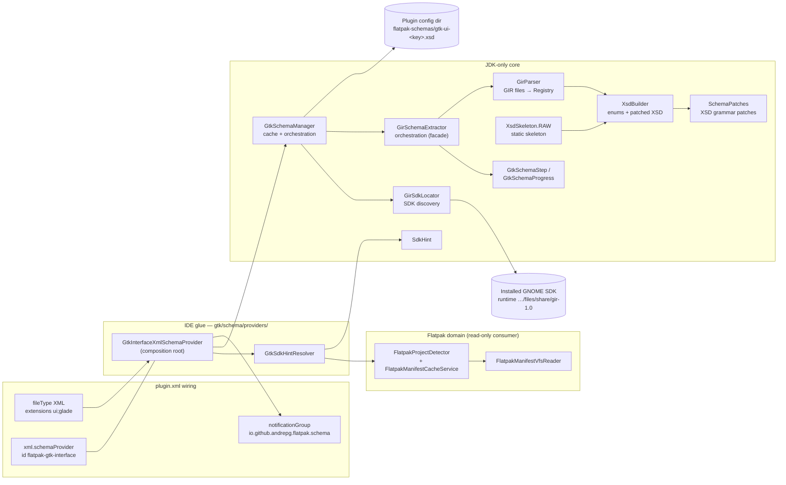
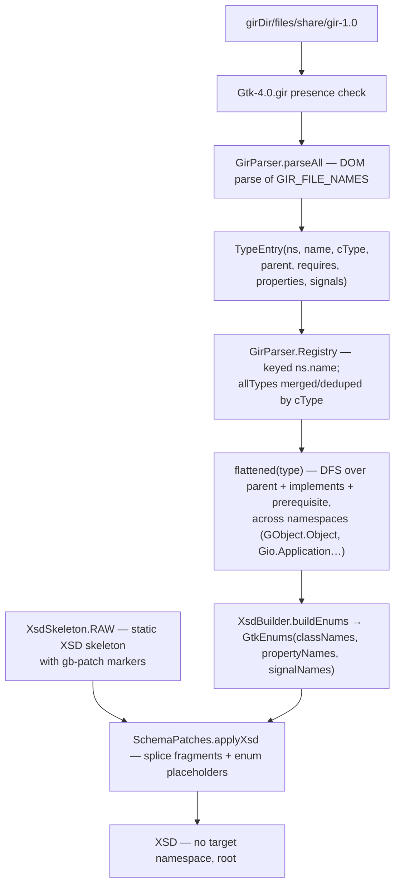

# Runtime GTK SDK Schema Generation

Architecture of the GtkBuilder `.ui`/`.glade` completion and validation feature.
Since the removal of the bundled schema pipeline (`generateBundledGtkSchema`,
`gtk-ui.xsd`, `gtk-ui-schema.json`), **runtime generation from the user's
installed GNOME SDK is the only schema source** — there is no bundled fallback.

> Status: 2026.1.x. This document describes the current architecture; sections
> marked *Extension hook* are deliberate landing points for future work (tag
> documentation, attribute options, richer type information).

---

## Design principles

| Principle | Consequence |
|---|---|
| Runtime-only | The XSD is generated from GIR data shipped inside the SDK the project actually targets — never a stale snapshot bundled at build time |
| JDK-only core | `gtk/schema/`, `gtk/schema/gir/`, `gtk/schema/locator/` import nothing from IntelliJ or the Flatpak domain: they run inside the IDE and stay unit-testable |
| IDE glue at the edge | Only `gtk/schema/providers/` touches platform APIs; it is also the composition root |
| Non-fatal generation | Any discovery/parse/render failure degrades to "no schema served" plus a warning balloon; the editor keeps working |
| Idempotent caching | One generated XSD per SDK identity (`gtk-ui-<key>.xsd`), reused across projects and sessions |
| One attempt per session | A failed generation is not retried automatically until the next IDE session (per cache key) |

## Component map



| Component | Path | Responsibility |
|---|---|---|
| `GtkInterfaceXmlSchemaProvider` | `src/main/kotlin/io/github/andrepg/gtk/schema/providers/GtkInterfaceXmlSchemaProvider.kt` | Serves the XSD to the XML plugin; decides availability; schedules background generation; reports progress and notifies |
| `GtkSdkHintResolver` | `…/providers/GtkSdkHintResolver.kt` | Derives the `SdkHint` from project manifests (`sdk` preferred over `runtime`, `org.gnome.*` only) |
| `SdkHint` | `…/schema/SdkHint.kt` | Value type: `sdkAppId` + optional `branch`; stable cache `key` = `<appId>-<branch>` (or bare appId) |
| `GtkSchemaManager` | `…/schema/GtkSchemaManager.kt` | Cache lookup, one-shot scheduling guard, locate → generate → persist |
| `GirSdkLocator` | `…/schema/locator/GirSdkLocator.kt` | Finds `<install>/files/share/gir-1.0` for an SDK app-id/branch |
| `GirSchemaExtractor` | `…/schema/gir/GirSchemaExtractor.kt` | Thin facade: `Gtk-4.0.gir` presence check → parse → render orchestration |
| `GirParser` | `…/schema/gir/parser/GirParser.kt` | Parses GIR files into a type `Registry` (classes/interfaces, properties/signals) |
| `XsdBuilder` / `XsdSkeleton` | `…/schema/gir/builder/` | Derives name enums from the registry; renders the static skeleton through the patches |
| `SchemaPatches` | `…/schema/gir/SchemaPatches.kt` | Splices GtkBuilder grammar constructs GIR cannot express into the skeleton |
| `FlatpakProjectDetector` / `FlatpakManifestCacheService` | `…/flatpak/detection/` | Manifest discovery (filename heuristic + cached content-root walk, VFS-invalidated) |
| `FlatpakManifestVfsReader` | `…/flatpak/utils/FlatpakManifestReaders.kt` | VFS-based field reading (`sdk`, `runtime`) — the only touchpoint into the Flatpak domain |

## End-to-end flow

```mermaid
sequenceDiagram
    autonumber
    participant Ed as Editor (.ui file)
    participant Pr as GtkInterfaceXmlSchemaProvider
    participant Hr as GtkSdkHintResolver
    participant Dt as FlatpakProjectDetector
    participant Mg as GtkSchemaManager
    participant Lc as GirSdkLocator
    participant Ex as GirSchemaExtractor
    participant Fs as Config-dir cache

    Ed->>Pr: getSchema(url, module, baseFile)
    Note over Pr: isAvailable: .ui/.glade by name;<br/>.xml only when root is <interface>
    Pr->>Hr: resolve(project)
    Hr->>Dt: findManifests(project) [cached]
    Dt-->>Hr: [(manifest, appId)]
    Hr->>Hr: read sdk/runtime, require org.gnome.*
    Hr-->>Pr: SdkHint? (first match wins)

    Pr->>Mg: cachedSchema(hint)
    alt cache hit
        Mg-->>Pr: gtk-ui-<key>.xsd
        Pr-->>Ed: XmlFile served via VFS/PsiManager
    else cache miss
        Pr->>Mg: markRequested(hint) — once per key/session
        Pr->>Pr: Task.Backgroundable (cancellable, determinate)
        Pr->>Lc: locate(appId, branch, flatpakBinary)
        Lc->>Lc: supportedSdks gate; flatpak list/info only
        Lc-->>Ex: girDir (files/share/gir-1.0)
        Ex->>Ex: parse GIRs → Registry → enums → XSD
        Pr->>Fs: write gtk-ui-<key>.xsd
        Pr-->>Ed: balloon success/failure; next getSchema serves cache
    end
```

Availability rules:

- `.ui` and `.glade` files qualify by name alone (case-insensitive).
- Plain `.xml` qualifies only when its root element is `<interface>` **and** the
  project yields an `SdkHint` (recognized Flatpak project targeting GNOME).
- Until a first successful generation there is **no schema** for any file type;
  the failure path surfaces through the warning balloon.

## SDK discovery (`GirSdkLocator`)

Only SDKs in the curated `supportedSdks` list (currently `org.gnome.Sdk` and
`org.freedesktop.Platform`) participate in discovery; anything else — including
unrecognized manifest values — short-circuits to `null`. The list is reviewed
by hand, like `SchemaPatches`.

Resolution strategy, CLI-only (there is no install-root fallback):

1. **flatpak CLI**: `flatpak list --runtime --columns=application,branch,installation`
   (10 s timeout). Branch selection: the manifest's branch when installed,
   otherwise the highest numeric branch; ties prefer user installations over
   system ones.
2. **CLI location**: `flatpak info --show-location <app-id>//<branch>` →
   `<location>/files/share/gir-1.0`, accepted only if `Gtk-4.0.gir` exists.

Any miss (CLI missing or silent, unsupported SDK, absent runtime, missing GIR)
returns `null`; the caller then serves no schema and logs
`Could not locate GIR dir …; no schema will be served`.

## GIR → XSD pipeline



Inputs (`GIR_FILE_NAMES`, parsed in order):

| File | Required | Provides |
|---|---|---|
| `Gtk-4.0.gir` | yes | GTK 4 widget classes, properties, signals |
| `GtkSource-5.gir` | no (skipped with a warning) | `GtkSourceView` family |
| `Adw-1.gir` | no* | Libadwaita classes (`AdwHeaderBar`, `AdwBreakpoint`…) |
| `GObject-2.0.gir` | no* | inheritance root for flattening |
| `Gio-2.0.gir` | no* | cross-namespace interface members |

\* listed as optional by the loader, but their absence weakens flattening and
class coverage; a real GNOME SDK ships all of them.

Grammar constructs GIR cannot express are added by three named patches:

| Patch id | What it fixes |
|---|---|
| `class-name-union` | `class`/`parent` attributes accept known GIR cTypes **or** any app-defined identifier (`[A-Za-z_][A-Za-z0-9_.]*`) |
| `property-element` | Widget-valued properties may nest an `<object>`; translatable/context/comments attributes |
| `signal-element` | `handler`/`object`/`swapped`/`after` attributes plus the signal-name enum |

`applyXsd` fails fast (`check`) on unknown, duplicated, or unresolved patch
markers/placeholders — a corrupted skeleton can never ship silently.

<!-- Extension hook: tag documentation, attribute value enums, per-widget docs
     from GIR <doc> elements plug in as additional patches here. -->

## Caching model

Resolution order in `GtkSchemaManager`:

1. Cached generated XSD: `<config>/flatpak-schemas/gtk-ui-<key>.xsd`
   (`PathManager.getConfigDir()`), where `<key>` = `<appId>-<branch>` or the
   bare appId when the manifest pins no branch.
2. Locate GIR dir → generate → write cache (idempotent).
3. Return null → provider serves nothing.

Notes:

- Different SDK branches produce different keys, so multiple SDKs coexist.
- There is currently **no invalidation**: an SDK upgrade reuses the old file
  until the config-dir cache is cleared or the key changes.
  <!-- Extension hook: regeneration triggers on runtime install/change events. -->
- `markRequested` guarantees a single background attempt per key per session.

## Progress & UX surface

| Step | Indicator fraction | Message key |
|---|---|---|
| Locating | 0.05 | `gtk.schema.generation.step.locating` |
| Parsing (i/n) | 0.1 + 0.8·(i/n) | `gtk.schema.generation.step.parsing` |
| Rendering | 0.95 | `gtk.schema.generation.step.rendering` |
| Caching | 1.0 | `gtk.schema.generation.step.caching` |

- Generation runs as a cancellable `Task.Backgroundable`; cancelling aborts
  before anything is written to the cache.
- Outcome balloons use notification group `io.github.andrepg.flatpak.schema`
  (`…notification.success` / `…notification.failure`).

## Failure modes

| Condition | Behavior |
|---|---|
| No manifest / non-GNOME `sdk`+`runtime` | Null hint; `.ui` files get no schema; plain `.xml` files are excluded entirely |
| SDK runtime not installed | Locator returns null → warn log + failure balloon |
| GIR parse/render error | Warn log + failure balloon; nothing cached |
| User cancels the progress task | Silent abort; nothing cached |
| Stale cache from an older SDK | Served as-is (no invalidation yet) |

## Testing story

- Hermetic fixtures under `test-data/gir` drive `GirParserTest` and `GirSchemaExtractorTest`
  (parsing, registry flattening across namespaces, XSD patching, progress and
  cancellation semantics).
- `GtkSchemaManagerTest` exercises caching/idempotence/cancellation against
  temp dirs with fabricated install roots and a bogus flatpak binary.
- `GtkSdkHintResolverTest` mocks `VirtualFile`s to test manifest→hint logic
  without a running IDE; `GtkInterfaceXmlSchemaProviderTest` covers the
  availability matrix.

## Future work (extension hooks)

1. **Tag documentation** — attach GIR `<doc>` extracts as `xs:documentation`
   so quick-docs work on `.ui` elements.
2. **Attribute options** — enumerate property value constraints (enums,
   flags, numeric ranges) instead of free-form strings.
3. **More grammars** — additional `SchemaPatches` entries (menu models,
   constraints, size-group patterns).
4. **Cache invalidation** — regenerate on runtime install/update events.
5. **Multi-hint projects** — pick the closest match when several manifests
   declare different GNOME runtimes.
